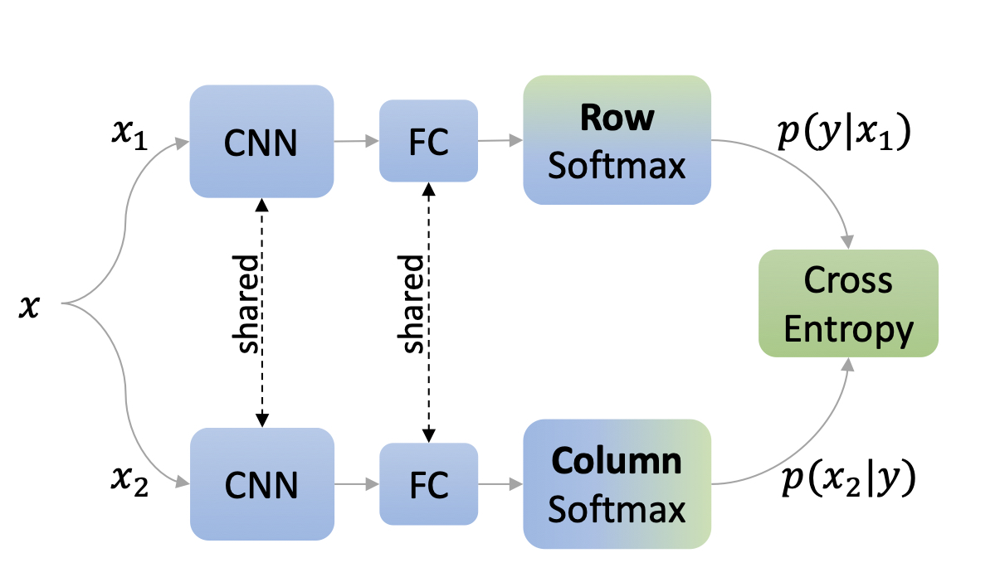

# Self-Classifier: Self-Supervised Classification Network

Official PyTorch implementation and pretrained models of the paper [Self-Supervised Classification Network](https://arxiv.org/abs/2103.10994). Self-Classifier is a self-supervised end-to-end classification neural network. It learns labels and representations simultaneously in a single-stage end-to-end manner.

**Self-Classifier architecture**. Two augmented views of the same image are processed by a shared network. The cross-entropy of the two views is minimized to promote same class prediction while avoiding degenerate solutions by asserting a uniform prior. The resulting model learns representations and class labels in a single-stage end-to-end unsupervised manner. CNN: Convolutional Neural Network; FC: Fully Connected.

## Setup

1. Install Conda environment:

        conda env create -f ./environment.yml

2. Install Apex with CUDA extension:
 
        export TORCH_CUDA_ARCH_LIST="7.0"  # see https://en.wikipedia.org/wiki/CUDA#GPUs_supported
        pip install git+git://github.com/NVIDIA/apex.git@4a1aa97e31ca87514e17c3cd3bbc03f4204579d0 --install-option="--cuda_ext"         

## Training & Evaluation

Distributed training & evaluation is available via Slurm. See SBATCH scripts [here](./scripts). 

**IMPORTANT**: set DATASET_PATH, EXPERIMENT_PATH and PRETRAINED_PATH to match your local paths.
 

### Training

For training self-classifier on 4 nodes of 4 GPUs each for 800 epochs run:

        sbatch ./scripts/train.sh

### Evaluation

#### Image Classification with Linear Models

For training a supervised linear classifier on a frozen backbone, run:

        sbatch ./scripts/eval.sh

#### Unsupervised Image Classification

For computing unsupervised image classification metrics (NMI: Normalized Mutual Information, AMI: Adjusted Normalized Mutual Information and ARI: Adjusted Rand-Index) and generating qualitative examples, run:

        sbatch ./scripts/cls_eval.sh
        
#### Image Classification with kNN

For running K-nearest neighbor classifier on ImageNet validation set, run:

        sbatch ./scripts/knn_eval.sh

#### Ablation study

For training the 100-epoch ablation study baseline, run:

        sbatch ./scripts/ablation/train_100ep.sh

For training any of the ablation study runs presented in the paper, run:

        sbatch ./scripts/ablation/<ablation_name>/<ablation_script>.sh
        
## Pretrained Models

Download pretrained 100/800 epochs models [here](https://drive.google.com/drive/folders/1Jnr2S6ADn3-m5wfd-MZO29A_2FUdS3KD?usp=sharing).

## License

See the [LICENSE](./LICENSE) file for more details.

## Citation

If you find this repository useful in your research, please cite:

    @article{amrani2021self,
      title={Self-Supervised Classification Network},
      author={Amrani, Elad and Bronstein, Alex},
      journal={arXiv preprint arXiv:2103.10994},
      year={2021}
    }

